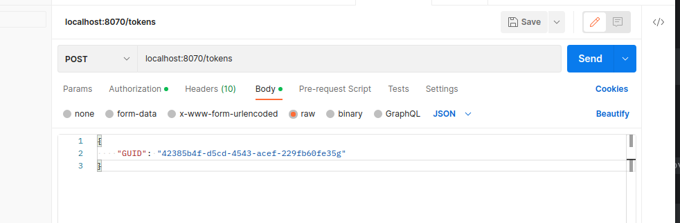
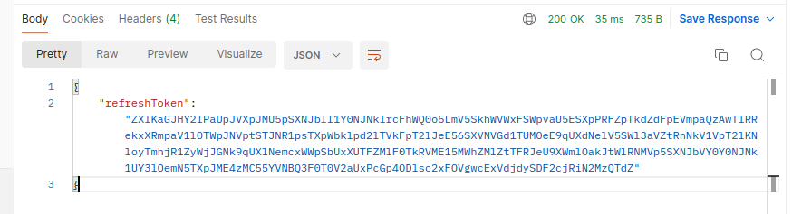
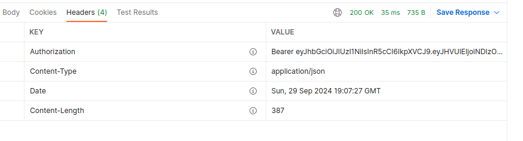
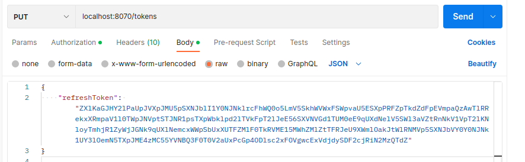
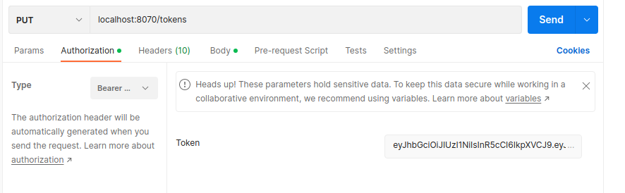

Solution of the [test task](https://medods.notion.site/Test-task-BackDev-623508ed85474f48a721e43ab00e9916) 
for [MEDODS](http://medods.ru/) company.

## Functionality:

1) <b>Create tokens:</b><br>
Request:

Refresh token in response body:

Access token in Authorization Header:

2) <b>Refresh tokens:</b><br>
Request:


Refresh token in response body:

Access token in Authorization Header:


## Tests

To run test use next commands. Coverage info will be
recorded to ```tests/coverage``` folder:

```shell
task -d scripts tests -v
```

## Linters

```shell
 task -d scripts linters -v
```

## Migrations

To create migration file, use next command:

```shell
task -d scripts makemigrations NAME={{migration name}}
```

To apply all available migrations, use next command:

```shell
task -d scripts migrate
```

To migrate up to a specific version, use next command:

```shell
task -d scripts migrate_to VERSION={{migration version}}
```

To rollback migrations to a specific version, use next command:

```shell
task -d scripts downgrade_to VERSION={{migration version}}
```

To rollback all migrations (careful!), use next command:

```shell
task -d scripts downgrade_to_base
```

To print status of all migrations, use next command:

```shell
task -d scripts migrations_status
```
